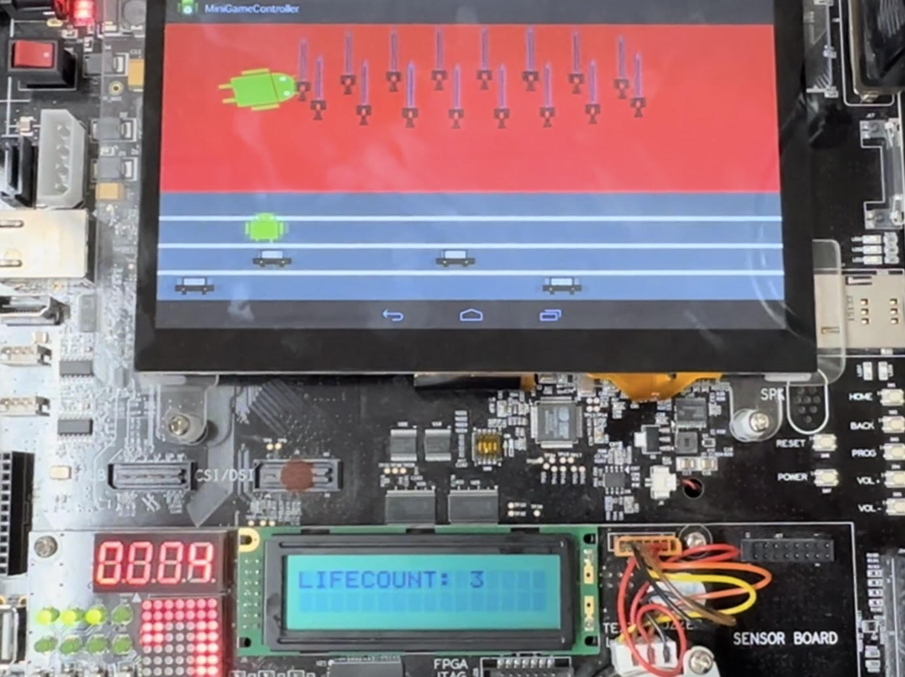
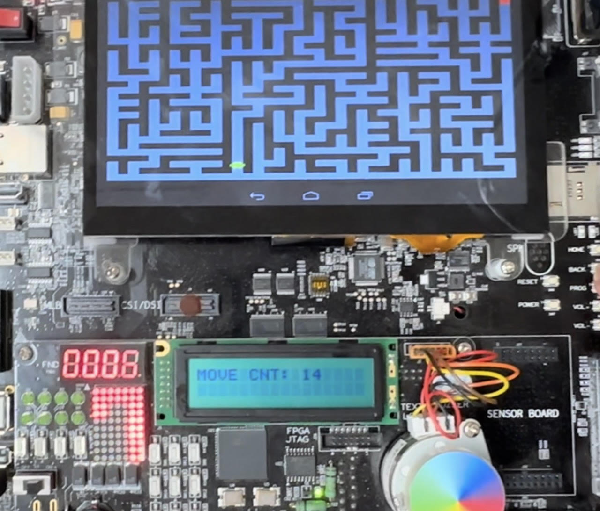

# Android Mini Game Project Using NDK and OpenGL ES 2.0

This project is an Android mini game application utilizing NDK and OpenGL ES 2.0. Below are the details of the project:

## Project Details

- **NDK Version**: r10e
- **External Library**: GLM 0.9.5.4 (Header-Only library version, 2014-06-21)

## Games Included

### Game 1: Car Avoidance Game

In this game, the player must avoid cars using directional controls. The game starts with 3 lives, which are displayed on an LED and text LCD. The game ends when the player-controlled character, Androboy, collects 3 cars. At this point, gameover motion is displayed.

- **Controls**: Move up, down, left, and right using dip switches.
- **Back Button**: Opens the game settings screen.
- **Timer**: Displayed on the FND and DOT during gameplay.  


### Game 2: Maze Game

In the maze game, the player navigates through a maze to reach the goal point. The number of moves made by the player is displayed on a text LCD. The game ends with an end motion upon reaching the goal point.

- **Controls**: Move up, down, left, and right using dip switches.
- **Back Button**: Opens the game settings screen.
- **Timer**: Displayed on the FND and DOT during gameplay.  


## Device driver info

- major number

    242

- minor number

    0

- device file location

    /dev/minigame

- ioctl command

    ```c
    #define IOCTL_RUN_TIMER_NONBLOCK _IO(MINIGAME_MAJOR, 0)
    #define IOCTL_STOP_TIMER_NONBLOCK _IO(MINIGAME_MAJOR, 1)
    #define IOCTL_OFF_TIMER_NONBLOCK _IO(MINIGAME_MAJOR, 2)
    #define IOCTL_RESET_TIMER_NONBLOCK _IO(MINIGAME_MAJOR, 3)
    #define IOCTL_SET_LED_NONBLOCK _IOW(MINIGAME_MAJOR, 4, int)
    #define IOCTL_SET_TEXT_LCD_NONBLOCK _IOW(MINIGAME_MAJOR, 5, char*)
    #define IOCTL_WAIT_BACK_INTERRUPT _IOR(MINIGAME_MAJOR, 6, int)
    ```

## Build and Run Instructions

1. Build and Push Modules:
    - Navigate to the /modules directory
    - Run the command: `make`
    - After the build is complete, run: `make push`
2. Prepare the Target Board:
    - On the target board, execute the script by running: `sh prepare.sh`
3. Build and Run the MiniGameController:
    - Navigate to the MiniGameController/ directory
    - Run the command: `ndk-build`
    - After the build is complete, run the application